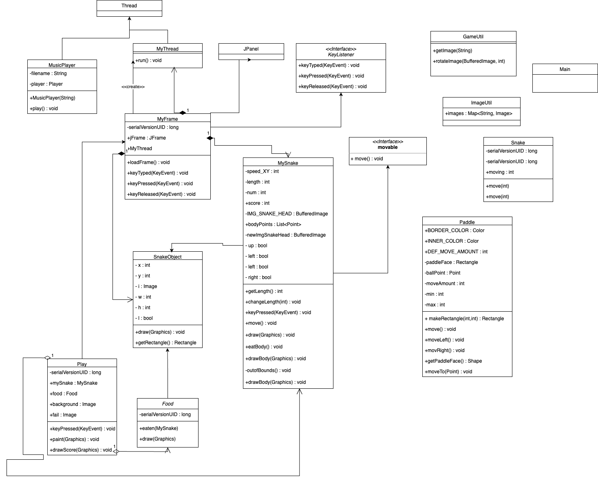
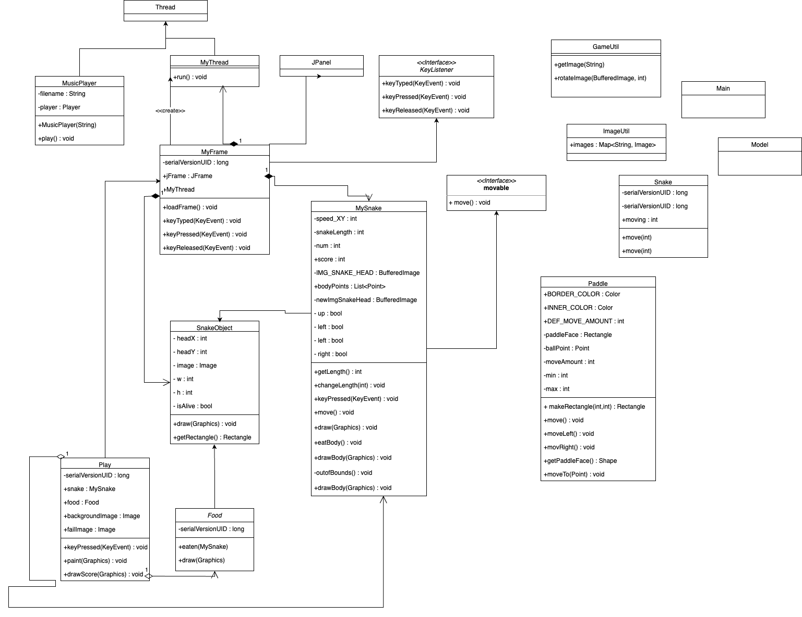

# Project Documentation

This document provides an overview of the project.

## Class Diagram (Before maintenance task)

## Class Diagram (After maintenance task)

## Overview

### Questions

1. **How is the frame of the snake updating every button click?**
   - The method responsible for updating the frame on button clicks is `MyFrame.keyPressed()`. The actual movement is handled by the `MyFrame.move()` method.

2. **How does it detect if it touched itself or the end of the screen?**
   - For detecting self-collision, the method `MyFrame.eatbody()` is used. To handle collisions with the screen edges, `MyFrame.outofBounds()` is employed.

3. **How does the snake grow, and what images/code is used?**
   - The snake grows by consuming food, and this growth logic is implemented in the `Food.eaten()` method.

4. **Where is the main logic of movement?**
   - The main logic for movement is centralized in the `MyFrame` class.

5. **Where is the main logic for score updating?**
   - Score updating is handled in `Food.eaten()`. The updated score is then passed to `MyFrame.MySnake`, and `Play.drawScore` displays it.

### Potential Adds to the Code

- Play again button
- Different “The End” UI
- Pause button
- Faster mode?
- More items that the snake can eat (to avoid it being too easy with only 16 items)
- Different music?
- Different background?
- Ending music as the snake dies.
- Levels or stages
- Power-ups
- Customization options
- Achievements or badges
- Obstacles avoidance
- High Scores and Leaderboard
- Sound Effects
- Tutorial (?)
- Random Events to add to the gameplay.

### Patterns and Basic Maintenance

### Basic Maintenance

- Package `example` was renamed to `SnakeGame` for clarity
- New class called `Model` has been created.
- `Movable` interface needs to be deleted as it is not needed. The movable interface only has one method, move(), and it's implemented by a single class. Given its simplicity and the fact that it's only used once, removing it simplifies the code without losing any functionality.
- In the `Food` class the variable `l` was renamed to `isAlive` to better convey it's meaning and the variable `i` was renamed to `image` for clarity
- In the `MySnake` class the variable `l` was renamed to `isAlive` to better convey it's meaning and `length` was renamed to `snakeLength`, and also `snkX` and `snkY` might be improved to `headX` and `headY` for better clarity.
- In the `MusicPlayer` class `filename` is clear but not using constant camel casing for better readability and clarity, was renamed to `musicFilename`
- In the `Play` class `mySnake` was changed to `snake` for brevity and `background` and `fail` could be more specific `backgroundImage` and `failImage`
- Changed this line of code inside `MyFrame` class - `jFrame.setTitle("Original Snake Game");` 

### Patterns

#### MVC
##### Model:
The Model handles all the important stuff like data and game logic. In my game, this means classes like `MySnake`, `Food`, and `Play`. They take care of things like moving the snake, checking for collisions, and updating the score.

#### View:
The View is responsible for presenting the data to the user and handling user inputs. In this case, the graphical representation of the game, including the snake, food, and UI elements, would be part of the View. Classes like `MyFrame` and any other classes responsible for rendering graphics and handling user input will be part of the View.

#### Controller:
The controller acts as an intermediary between the Model and the View. It handles user input, updates the Model accordingly, and ensures that the View reflects the changes in the Model.
In my game, the `keyPressed` method in `MyFrame` could be part of the Controller. It captures key presses, interprets them, and triggers actions in the Model, such as moving the snake.
Also as I am planning to add features like a pause button or play again button, the logic for handling these actions would also go into the Controller.

#### Observer Pattern:
- For components that need to be notified of changes in the game state (e.g., scoring, snake movement), I will consider the observer pattern.

- Implementation: Could have an Observable class that maintains a list of observers (e.g., components interested in game state changes) and notifies them when the state changes.

#### Singleton Pattern:
- For example for a global state or resource that should be shared across different parts of your game, a singleton might be appropriate.

- Implementation: Could include a global game manager or a high-score tracker.
