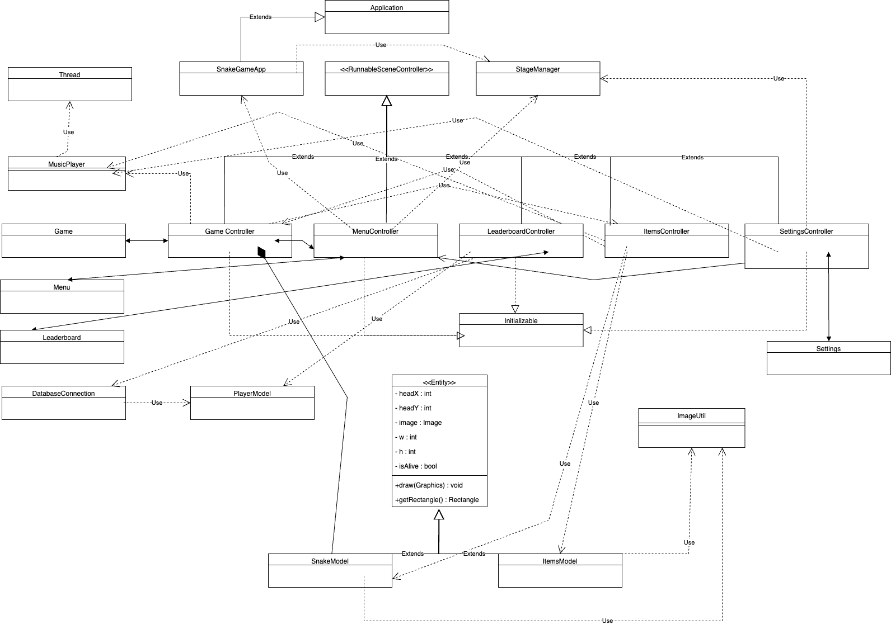
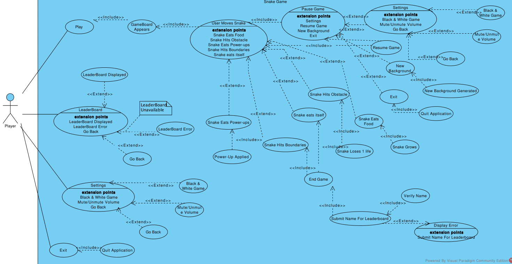

## Commit 1: MVC Structure and Refactoring

In this commit, we made significant strides towards adopting the Model-View-Controller (MVC) architectural pattern in the Snake Game project. Key changes include:

- **Renaming View Class:** Renamed `MyFrame` to `View` to align with MVC conventions, separating the user interface from game logic.
  
- **Model Refactoring:** Modified the `Model` class for improved structure and functionality, promoting better organisation and adherence to MVC principles.
  
- **Introducing Game Initiator:** Introduced a new class, `SnakeGameApp`, to handle game initiation, eliminating unnecessary logic from the now-deprecated `Main` class.
  
- **Boundary Collision Fix:** Addressed a boundary collision detection issue in the `View` class, ensuring smoother gameplay.
  
- **Music Handling Improvement:** Enhanced music handling in the `MusicPlayer` class, enabling continuous looping during gameplay and stopping on game end.
  
- **Redundant Class Removal:** Removed redundant classes, including `MyFrame.MySnake`, `Movable`, `Snake`, and `Paddle`.
  
- **New Class Introduction:** Introduced new classes, such as `Controller`, `MySnake`, and `SnakeObject`, to support better single responsibility and separation of concerns.

These changes lay the groundwork for a more organised and maintainable codebase following MVC design principles.

## Commit 2: Cleanup and Additional MVC Changes

The second commit builds upon the initial MVC refactor, focusing on further cleanup and optimisation:

- **File Cleanup:** Deleted unnecessary files, such as `Play.java` and `Snake.java`, streamlining the project structure.
  
- **Interface Removal:** Eliminated the outdated `movable` interface, recognising its redundancy.
  
- **View Optimisation:** Fine-tuned the `View` class, allowing the snake to navigate seamlessly around boundaries.
  
- **Class Creation:** Created new classes, including `Controller`, `MySnake`, and `SnakeObject`, to reinforce the single responsibility principle and enhance code modularity.
  
- **Version Control Cleanup:** Ensured the project adheres to cleaner version control practices, addressing issues like accidentally created directories.

These combined changes mark a significant step towards a well-organised, maintainable, and extensible Snake Game project, aligning with best practices in software development.

## Final Documentation

### Final Class Diagram

## Talking Points for Design and Refactoring Activities

### High-level Class Diagram

### UML Diagram

### Refactoring Activities

I've included a high-level class diagram that visually represents the key classes and their relationships in the system. This provides a bird's-eye view of the software architecture, helping us understand the structure and interactions between different components.

1. **Organised Project Structure:**
   - Implemented well-organised files with meaningful names.
   - Grouped class types like Models and Controllers into separate packages for clarity.
   - Notable classes include SnakeModel and PlayerModel, enhancing organisation and functionality highlighting.

2. **Encapsulation and Deletions:**
   - Renamed classes (e.g., Food to ItemsModel) for clarity and consistency.
   - Applied encapsulation to various classes (Entity, ImageUtil, ItemsModel, PlayerModel, SnakeModel).
   - Deleted unused resources such as Play, Paddle, MyFrame, GameUtil, Snake, movable interface, and assets.

3. **Single Responsibility Principle and MVC Implementation:**
   - Refactored classes like SnakeModel and Entity to follow the single responsibility principle.
   - Implemented the MVC pattern with organised Models and Controllers (e.g., SnakeGame.Models and SnakeGame.Controllers).
   - Utilised FXML for MVC implementation, separating data storage and retrieval (Models) from interactions and game logic (Controllers).

4. **Singleton and Testing:**
   - Utilised the singleton pattern for StageManager, providing centralised control.
   - Implemented comprehensive unit, integration, and UI testing with JUnit.

5. **JavaFX Transition:**
   - Successfully transitioned from Swing to JavaFX, incorporating fxml files and JavaFX features into model and controller classes.
   - Placed the module-info.java file in src/main/java.

6. **Start Screen and Accessibility:**
   - Designed the start screen as the main menu using MenuBackground.jpg with a green colour theme.
   - Implemented a settings page for sound muting/unmuting and included a black and white mode for colour-blind users.
   - MenuController.java manages start/pause/end functionality and includes a settings button.

7. **Leaderboard and Object Management:**
   - GameController.java manages storing the player's name and passing it to DatabaseConnection.java for leaderboard updates.
   - LeaderboardController.java displays all-time top scores and associated player names.
   - ItemsModel.java manages object pictures (food, obstacles, power-ups), and GameController.java handles the snake's body and head.

8. **Gameplay Experience Enhancements:**
   - Implemented the ability to change the map's background when paused.
   - Added obstacles and power-ups for a richer gameplay experience.
   - Added three different power-ups, with obstacles deducting points and snake body on collision.

## Achievements

1. **Power-Up Collection Logic:**
   - A significant achievement is enabling users to collect power-up points, requiring intricate logic and creative game development.

2. **Dynamic Background Image and Accessibility Support:**
   - Proud achievement in allowing users to dynamically change the background image during gameplay.
   - Considerate design with accessibility features, including a black and white mode for users with colour-blindness.